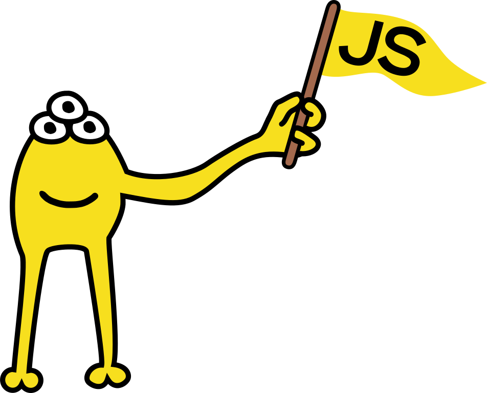

# JavaScript Mascot

A mascot for JavaScript.

## Description

A yellow creature with three eyes and one arm, holding a JavaScript flag. A distant relative of the Lisp mascot.

## Files

The files are available in this repository, in various formats and sizes.

The files are also available in [Wikimedia Commons](https://commons.wikimedia.org/wiki/File:JavaScript_mascot.svg).

## Gallery

Send us your own creations at javascriptmascot@gmail.com or open a pull request in this repository!

Bliss
 

Holding a TypeScript flag
 

Holding a React flag
 

On the transgender pride flag
 

As ASCII art (it can be cound in the file javascript_mascot_ascii.txt)

## Contribution

The mascot belongs to the community. Any contributions and any ideas or proposals for improvements or modifications are more than welcome!

## License

**[Attribution-ShareAlike 4.0 International (CC BY-SA 4.0)](https://creativecommons.org/licenses/by-sa/4.0/deed.en)**

**You are free to:**

**Share** — copy and redistribute the material in any medium or format

**Adapt** — remix, transform, and build upon the material for any purpose, even commercially.

This license is acceptable for Free Cultural Works. The licensor cannot revoke these freedoms as long as you follow the license terms.
