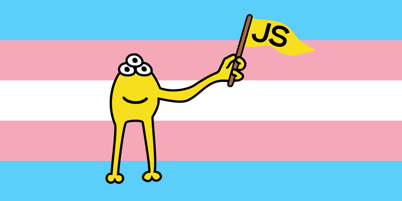

# JavaScript Mascot

A mascot for JavaScript.

## Description

A yellow creature with three eyes and one arm, holding a JavaScript flag. A distant relative of the Lisp mascot.

## Files

The files are available in various formats and sizes.

## Contributing

The mascot belongs to the community.

Our mascot is a symbol of our community, and we’d love to hear your ideas, suggestions, and any improvements or changes you think could make it better!

If you've created any artwork featuring the mascot we encourage you to share them with us!

Send us your creations at <javascriptmascot@gmail.com> or open a pull request in this repository!

## Gallery

*Bliss*
 
 

*Holding a TypeScript flag*
 
 

*Holding a React flag*
 
 

*On the transgender pride flag*
 
 

*As ASCII art (it can be cound in the file javascript_mascot_ascii.txt)*

## Fan Art

*Victory for JavaScript! Created by [Gensou](https://somewhereingensokyo.neocities.org/)*
 
 

# Pixel Art

# Other

## License

**[Attribution-ShareAlike 4.0 International (CC BY-SA 4.0)](https://creativecommons.org/licenses/by-sa/4.0/deed.en)**

**You are free to:**

**Share** — copy and redistribute the material in any medium or format

**Adapt** — remix, transform, and build upon the material for any purpose, even commercially.

This license is acceptable for Free Cultural Works. The licensor cannot revoke these freedoms as long as you follow the license terms.
